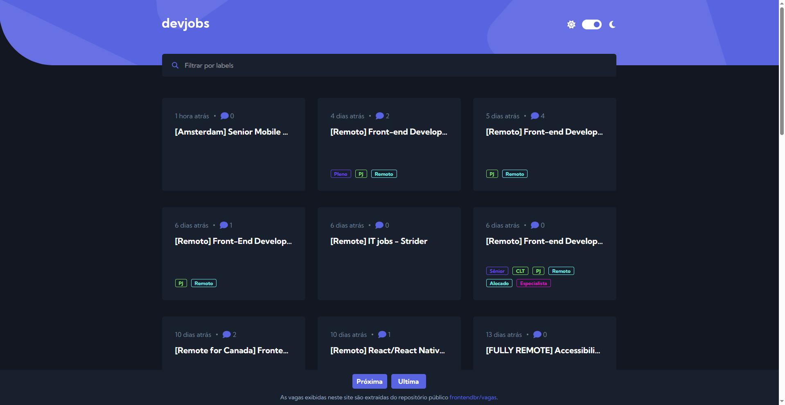

# Devjobs

O Devjobs é um aplicativo web que facilita a busca por oportunidades na área de tecnologia. Ele consome a API do GitHub para obter as issues do repositório [frontendbr/vagas](https://github.com/frontendbr/vagas/issues) e exibe as vagas de forma organizada em uma interface intuitiva e responsiva.

## Visão geral

### Comportamento esperado

- Visualizar o quadro de vagas
- Filtrar vagas por palavras chaves relacionada as vagas 
- Visualizar um vaga em especifico.

### Captura de tela



### Links

- Repositorio GitHub: [Adicione a URL da solução aqui](https://your-solution-url.com)
- App: [Adicione a URL do site ativo aqui](https://your-live-site-url.com)

### Contruído com

- Marcação HTML5 semântica
- Talwind - CSS
- TypeScript
- Svelte
- SvelteKit

## Criando um projeto

```bash
# crie um novo projeto no diretório atual
npx sv create

# crie um novo projeto em my-app
npx sv create my-app
```

## Desenvolvendo

Depois de criar um projeto e instalar dependências com `npm install` (ou `pnpm install` ou `yarn`), inicie um servidor de desenvolvimento:

```bash
npm run dev

# ou inicie o servidor e abra o aplicativo em uma nova aba do navegador
npm run dev -- --open
```